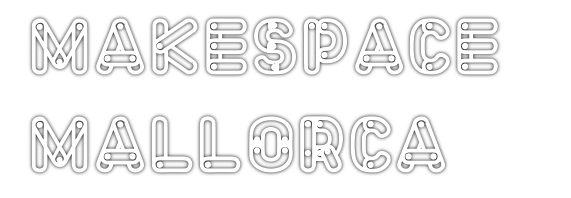

# Un poco de historia
En agosto de 2018 un pequeño grupo con inquietudes tecnológicas comunes y una gran afición al _hazlo tu mismo_. Arrancó el grupo de [MeetUp Makespace Mallorca](https://www.meetup.com/es-ES/Meetup-de-Startups-de-tecnologia-en-Palma/?_locale=es-ES) que no ha parado sus actividades hasta la fecha. 

En torno a estos encuentros, ha ido creciendo una Comunidad que quiere ser más colaborativa y con más recursos. Por lo que, bajo la denominación de **Makers Mallorca, Asociación de investigación y divulgación tecnológica**, se constituyó en 2019 esta asociación sin ánimo de lucro para facilitar proyectos y objetivos comunes de la Comunidad Maker de nuestra isla. 

# ¿Por qué existimos?
Como decía aquel programa ochentero de la Bola de Cristal: "Solo no puedes, con amigos sí". Aunque tenemos muchos recursos on-line para avanzar en los proyectos. Nada es mejor que la experiencia cercada de quien te puede enseñar en directo cómo ajustar una impresora 3D o programar un Arduino. 
<br>
Para organizar charlas y talleres. Tener un punto de encuentro y traer a Mallorca personas y eventos que antes teníamos que ir a ver. 
Ahora tenemos un nuevo espacio de fabricación digital y un grupo entusiasta del movimiento Maker con muchos proyectos en marcha. La perfecta combinación para hacer proyectos colaborativos

```text
Socializar y compartir tus proyectos los pueden llevar dónde nunca has imaginado.
Encontrarás personas entusiastas con similares inquietudes tecnologías que ayudarán
a que todo funcione e incluso mejor de lo esperado.
```

**Para saber más**  
[Estatutos de la Asociación](https://github.com/Makespace-Mallorca/Estatutos-Reglamento/blob/master/Estatutos.md)

## El espacio de fabricación digital que siempre has soñado.
La Asociación ha nacido junto al [FabLab de Mallorca](http://fablabmallorca.com/) y coexiste en sus actividades. Los socios tienen ventajas en la afiliación y uso del espacio. El espacio te ofrece herramientas como cortadoras laser, impresoras 3D, CNC… La solución cuando ya no caben tus proyectos en tu casa y te estás gastando más en máquinas que en proyectos.
Estamos formado una comunidad comprometida con el movimiento Open Hardware y Software en la que compartimos conocimientos y experiencias.
<br>
Fieles al manifiesto Maker toda nuestra labor es pùblica, compartida y basada en hardware y software libre. Lee el [Maniefiesto Maker](https://github.com/Makespace-Mallorca/makespacemallorca.github.io/blob/master/images/makespacemallorca_manifesto.png?raw=true)

# Próximas actividades y talleres
<a href="./registro-taller-FPGA.html">

## Taller FPGA con Julian Caro
Para todos los amantes de la micro-electrónica y la programación. Hemos organizado desde la Asociación y el FabLab de Mallorca un gran evento. 
<br>
Toda una mañana con el mejor profesor y divulgador de las FPGA libres, [Julian Caro Linares](https://github.com/jcarolinares). Con las placas Icezum Alhambra I prestadas por la comunidad PGA Wars. Nos enseñará cómo usar esta tecnología simulando el algoritmo de la máquina alemana Enigma de la II Guerra Mundial. Que podremos ver en directo en el Castillo de San Carlos de la mano de un historiador del Patronato.
[¿Te lo vas a perder? Inscríbete aquí](./registro-taller-FPGA.html).

Síguenos en MeetUp, y estarás al día de nuestras actividades.
<br>
<a href="https://www.meetup.com/es-ES/makespace-mallorca/">

# Únete y participa
<a href="./registro-socio.html">

## Asociate
Makers de Mallorca, necesita tu ayuda para continuar con nuestros objetivos y actividades. 
Pulsa este link para acceder a un rápido formulario [registro de socio](./registro-socio.html).

## Participa
Aquí nos encontrarás y también puedes participar libremente en debates, expón tus dudas y haz sugerencias:

<a href="https://t.me/joinchat/GA2cyBIjeJ5Zht2B9WhYKQ">
<a href="http://www.twitter.com/MakespacePMI">
<a href="mailto:makespace.mallorca@gmail.com">


[Consulta aquí nuestra política de privacidad](./politica-de-privacidad-y-cookies.html)
