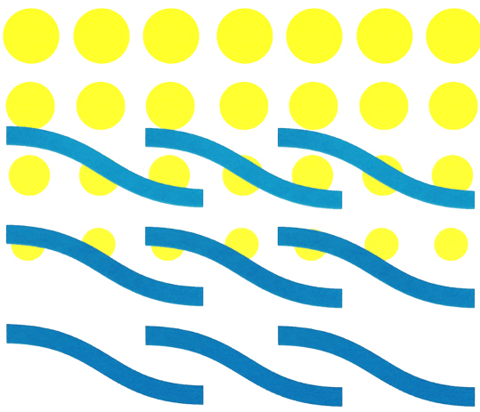
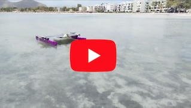
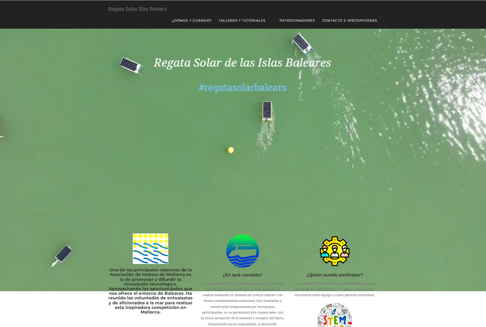

# Un poco de historia
En agosto de 2018 un pequeño grupo con inquietudes tecnológicas comunes y una gran afición al _hazlo tu mismo_. Arrancó el grupo de [MeetUp Makespace Mallorca](https://www.meetup.com/es-ES/Meetup-de-Startups-de-tecnologia-en-Palma/?_locale=es-ES) que no ha parado sus actividades hasta la fecha. 

En torno a estos encuentros, ha ido creciendo una Comunidad que quiere ser más colaborativa y con más recursos. Por lo que, bajo la denominación de **Makers Mallorca, Asociación de investigación y divulgación tecnológica**, se constituyó en 2019 esta asociación sin ánimo de lucro para facilitar proyectos y objetivos comunes de la Comunidad Maker de nuestra isla. 

# ¿Por qué existimos?
Como decía aquel programa ochentero de la Bola de Cristal: "Solo no puedes, con amigos sí". Aunque tenemos muchos recursos on-line para avanzar en los proyectos. Nada es mejor que la experiencia cercada de quien te puede enseñar en directo cómo ajustar una impresora 3D o programar un Arduino. 
<br>
Para organizar charlas y talleres. Tener un punto de encuentro y traer a Mallorca personas y eventos que antes teníamos que ir a ver. 
Ahora tenemos un nuevo espacio de fabricación digital y un grupo entusiasta del movimiento Maker con muchos proyectos en marcha. La perfecta combinación para hacer proyectos colaborativos. No dudes en registrarte [aquí](./registro-socio.md) si quieres formar parte de esta asociación.

```text
Socializar y compartir tus proyectos los pueden llevar
dónde nunca has imaginado.Encontrarás personas entusiastas 
con similares inquietudes tecnologías que ayudarán
a que todo funcione e incluso mejor de lo esperado.
```

**Para saber más | registrarse**  
[Estatutos de la Asociación](https://github.com/Makespace-Mallorca/Estatutos-Reglamento/blob/master/Estatutos.md) | [Registro de socio](./registro-socio.md).

## El espacio de fabricación digital que siempre has soñado.

La Asociación ha nacido junto al [FabLab de Mallorca](http://fablabmallorca.com/) y coexiste en sus actividades. Los socios tienen ventajas en la afiliación y uso del espacio. El espacio te ofrece herramientas como cortadoras laser, impresoras 3D, CNC… La solución cuando ya no caben tus proyectos en tu casa y te estás gastando más en máquinas que en proyectos.
Estamos formado una comunidad comprometida con el movimiento Open Hardware y Software en la que compartimos conocimientos y experiencias.
<br>
Fieles al manifiesto Maker toda nuestra labor es pùblica, compartida y basada en hardware y software libre. Lee el [Manifiesto Maker](https://github.com/Makespace-Mallorca/makespacemallorca.github.io/blob/master/images/makespacemallorca_manifesto.png?raw=true)

# ¿Qué estamos haciendo?

El trabajo colaborativo y social ha marcado desde un principio la manera en la que empleamos nuestro tiempo. Partimos de una iniciativa que puede surgir en cualquier ambito, desde un comentario en nuestro [canal de Telegram](https://t.me/+dakZQEg_YyxkMTBk) como en una iniciativa pública o de otras asociaciones o entidades. La clave está en que si se dan las circunstacias de una idea es bien acogida y sobre todo, se forma un equipo multidisplinar que cubra todos los roles necesarios para llevarla a cavo. El proyecto toma forma y queda abierto a la participación. 



## I Regata Solar Illes Balears 2023

Esta primavera nos espera un evento de dos días en torno a una competición de prototipos de barcos solares en uno de los sitios más emblemátivos de Palma de Mallorca.
Comenzará la tarde del viernes día 19 de mayo con charlas y coloquios de la mano de la Asociación acabando con una cena para conocernos. El día 20 se centrará en la regata con sus preparativos desde las 10 de la mañana. Finalizando con la entrega de premios.

### ¿En qué consiste?
Será una **competición de embarcaciones no tripuladas impulsadas por energía solar** y cuyo gobierno se realiza mediante un sistema de control remoto o de forma completamente autónoma.
Estarán diseñadas y construidas íntegramente por los equipos participantes, no se permitirán kits comerciales, con la única excepción de la emisora y receptor del barco, fomentando así la originalidad, el desarrollo tecnológico, la eficiencia del diseño y la sostenibilidad del mismo. 
[](https://youtu.be/HN6s5r-bW-M)

Tienes toda la información e inscripciones en la [Web de la I Regata Solar de Balears](https://www.regatasolarbalears.org/)
<br>

<a href="https://www.regatasolarbalears.org/">

La competición se celebraría en el incomparable marco del Parc de la Mar. El emblematico lago de agua salada frente a la catedrál de Palma.

>Es un proyecto alineado con los Objetivos de Desarrollo Sostenible de la agenda 2030 de la ONU y con la educación orientada STEM (Science Technology Engineering and Mathematics) tan necesaria en la actualidad, para garantizar el futuro de nuestros estudiantes y todas aquellas  personas que se quieran reciclar en estas materias, poniendo también el foco en conseguir equipos paritarios.


## Canamunt IoT. Primera red medioambiental abierta de Palma de Mallorca
Gracias a Associació de Veïnes de Canamunt que ha conseguido la financiación del proyecto. La comunidad Maker de Mallorca está desarrollando el proyecto de ciencia ciudadana en el que se va a dotar a este barrio de una red de sensores de calidad del aire, ruido ambiental, metereología y radiactividad con diseños propios y abiertos utilizando y ampliando la red LoRaWAN libre de The Things Networks.

El objetivo es que los propios **ciudadanos conozcan las tecnologías que definen la Smartcity del futuro, participen en su despliegue y que los Makers construyan sus  sensores** compartiendo el conocimiento de estas nuevas tecnologías a través de talleres realizados en el Fablab de Mallorca. 

El compromiso es que tanto los datos como el código sea abierto y accesible desde plataformas como GitHUb, Sentilo, sensor.community...


## MicroMouse. El robot ratón de competición
Es uno de los retos más complejos a la vez que divertidos en el ámbito de la robótica. Se trata de **construir un robot para ser el más rápido en resolver y completar un laberinto de forma autónoma**. Se le suele permitir estudiar el trazado del laberinto previamente. Existen competiciones en diferentes paises pero el equipo está preparándose para la competición más conocida en España, la [OSHWDem de la Coruña](https://oshwdem.org/).


##  RemoVir
Esta es nuestra aportación al compromiso que todos los Makers tenemos con la problemática del COVID-19. Estamos **diseñando la modificación de un Split de aire acondicionado para convertirlo en un purificador de aire con filtro HEPA** por poco más del coste de los filtros y lo más importante. Ayudar a mantener el medio ambiente mientras se protege del contagio de COVID-19 en espacios cerrados.
<br>
Sigue el proyecto en: [github.com/Makespace-Mallorca/removir](https://github.com/Makespace-Mallorca/removir)

# Próximas actividades y talleres

<a href="https://www.meetup.com/es-ES/makespace-mallorca/">

Síguenos en MeetUp, y estarás al día de nuestras actividades.
<br>

<a href="./registro-taller-FPGA.html">

## Taller FPGA con Julian Caro (Aplazado)
Para todos los amantes de la micro-electrónica y la programación. Hemos organizado desde la Asociación y el FabLab de Mallorca un gran evento. 
<br>
Toda una mañana con el mejor profesor y divulgador de las FPGA libres, [Julian Caro Linares](https://github.com/jcarolinares). Con las placas Icezum Alhambra I prestadas por la comunidad PGA Wars. Nos enseñará cómo usar esta tecnología simulando el algoritmo de la máquina alemana Enigma de la II Guerra Mundial. Que podremos ver en directo en el Castillo de San Carlos de la mano de un historiador del Patronato.

# Únete y participa
<a href="https://makespacemallorca.org/registro-socio/">

## Asociate
**Makers de Mallorca**, es más que un grupo de aficionados a la tecnología. Es tener acceso a eventos, talleres, chats, y FabLab donde desarrollar tus proyectos o mejorar tus habilidades. 
Pulsa este link para acceder a un rápido formulario [registro de socio](./registro-socio.md).

## Cuéntanos tu idea, porpón un proyecto.
```text
Haznos una propuesta o si estás dando vueltas a una idea o proyecto. Compártelo y quizás encuentres ayuda para llevar a cabo.  
```

<form id="fs-frm" name="Nuevas iniciativas MAKERs " accept-charset="utf-8" action="https://formspree.io/xknqwkqb" method="POST">
  <fieldset id="fs-frm-inputs">
    <label for="forull-name">Nombre</label>
    <input type="text" name="nombre" id="nombre" placeholder="Nombre" required="">
    <br>
    <label for="email-address">Email</label>
    <input type="email" name="email" id="email" placeholder="email@domain.tld" required="">       
    <br>
    <fieldset class="direccion">
      <legend>¿Quieres contarnos tu idea Maker?</legend>
      <label for="note">Describela aqui brevemente</label>
      <textarea rows="4" name="comentarios" id="comentarios" placeholder="escribe aquí"></textarea>
      <input type="hidden" name="_subject" id="email-subject" value="Ideas y propuestas">
    </fieldset>
    <br>
    <input type="submit" value="Enviar">
    <label for="submit">Pulsando Enviar acepta la Política de Privacidad</label>
  </fieldset>
</form>

## Síguenos en
Aquí nos encontrarás y también puedes participar libremente en debates, expón tus dudas y haz sugerencias:

<a href="https://t.me/joinchat/GA2cyBIjeJ5Zht2B9WhYKQ">
<a href="http://www.twitter.com/MakespacePMI">
<a href="mailto:makespace.mallorca@gmail.com">
<a href="https://www.youtube.com/channel/UCDm4Fy9tZBC9q-GoauDKBsA">

[Consulta aquí nuestra política de privacidad](./politica-de-privacidad-y-cookies.md)
